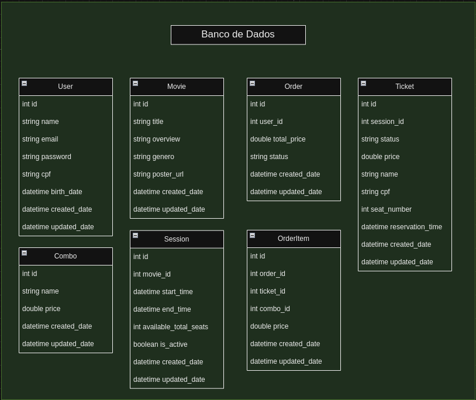

## 🎟️ Full-stack Challenge Ingresse - Back End - Spring Boot

## 📄 Descrição
Este repositório faz parte de um desafio full-stack onde o objetivo é desenvolver o back-end de uma plataforma de venda de ingressos de cinema.

## 🚧 Status do Projeto
Em andamento...

## 🛠️ Tecnologias Utilizadas
       

## 🗄️ Database Shema
 

